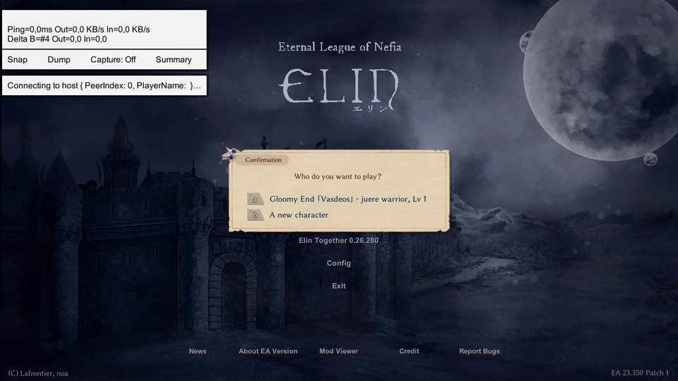
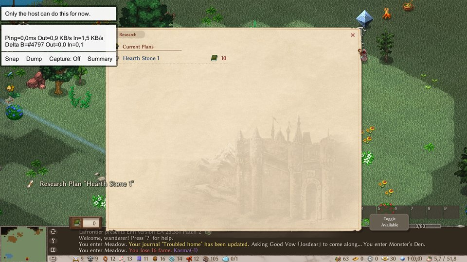

# Elin Together — "independence" fork

English | [Français](README_fr.md)

A fork of [Elin Together](https://github.com/ElinTogether/ElinTogether), the multiplayer mod for
[Elin](https://store.steampowered.com/app/2135150/Elin/), with one goal: **in game, no difference between the host
and the other players**. Everyone goes where they want, with their own companions, quests, fame and money, while
the world (story, home base, guilds) stays shared.

The original mod keeps the whole party on the host's map and treats the other players as teammates of the host.
Its authors consider separate maps out of scope; this fork is where that is tried. All credit for the mod itself
goes to them (see [Credits](#credits)).

> **Status: experimental.** Everything below is tested on one PC with two game windows (automated in-game test
> suites, over 900 checks, see `dev/`). It has been **barely played between two PCs over Steam**: one evening, which
> found a bug the tests had missed, and almost nothing new in this version (0.26.532) has been tried on two real PCs yet. Back up
> your saves first: `%USERPROFILE%\AppData\LocalLow\Lafrontier\Elin`.

## What the fork adds

| Feature | What it changes |
|---|---|
| Independent travel | A player leaves for another map without the host. The map and what was done there are kept. Progress is saved regularly while away; chat works across maps. |
| Shared maps | A player can join another player on their map, without the host. If the one holding the map leaves, another takes over. |
| The host drags nobody along | When the host changes map, the players who stayed behind stay. |
| Companions per player | Companions follow the player who recruited them, travel with them, and count in that player's ally limit only. |
| Shipping per player | One shipping chest; the money of a sale goes to whoever put the item in. |
| Combat at each player's pace | A monster acts at the pace of the player it fights, not the host's. |
| Random quests per player | Quests from inhabitants and boards belong to the player who takes them, with the reward, fame and karma. They follow the player everywhere. |
| Shared story | Story quests are in one log: anyone starts, advances and finishes them. Dialog memory, key items and debt are shared. |
| Dungeon quests for everyone | A player who is not the host can take a quest that has its own zone and settle it, alone or with the other player (next line). |
| Dungeon quests for two | When one player sets out on a quest, the other sees a Yes/No box to come along. The zone is shared, the reward goes to whoever took the quest. Works both ways; when the guest took the quest: "subdue", harvest and music quests (defense stays solo). |
| Trade between players | Click another player → "Trade": both put items and gold, both confirm. |
| Safer trade | It refuses what the solo game refuses to give away, refuses when the other's bag is full, and says why. |
| The game knows whose character is whose | When joining, a player gets the character they played, with no question asked; a new player makes one. |
| Karma and crime per player | The player who did it loses the karma; guards only chase that player. |
| Shared affinity and guilds | An inhabitant's affinity is the same for all; joining a guild counts for the group. |
| A guest plays like a solo player | Dozens of fixes since 0.26.399: death and will, the god's gifts, traps, spellbooks, healer, blessing, investing, runes, auto-dump, windows that used to open on the host, a gift taken out of a stack, a mount already taken, a log chopped with an axe, a prayer that heals companions, food in the bag that goes off… The list is in [`dev/DOCUMENTATION.md`](dev/DOCUMENTATION.md) (French). |
| Companion orders per player | The two tactics checkboxes that rule your companions (follow from further away; stay near you in a fight instead of chasing an enemy you cannot see) are your own, not the host's. |
| Home base set by a guest | Research, hearth skills and policies are real requests to the host (it checks, pays once, everyone sees the result). Also the maid, a resident's type (resident or livestock), reserve, recall and sending away; chest settings (priority, filter...) both ways. Beds, sale tags, notes and names are seen by the other player, both ways. Host checkbox "only the host manages the base" (HostManagesBase, unchecked). |
| Different Elin versions | Only the mod's version must be the same for everyone. Two players on different Elin versions can connect; they are told by a warning. A host checkbox ("Require the same Elin version", unchecked by default) asks for the same Elin version again. |
| Building as a guest | A guest uses the base's build mode like the host: floors, walls, menu furniture, mining, digging, cutting, zones, the terrain tool. What one builds is seen by the other at once. Host checkbox "GuestBuild" (checked). |
| Duels between players | "Challenge to a duel" in the menu on another player's character; the other answers a yes/no box, then a countdown. Nobody dies, both are healed, nothing is lost. Host checkbox "Duels" (checked). Not yet: arena, betting, give-up button. |
| No killing between players | A player can no longer kill another player outside a duel. Host checkbox "PlayerKill" (unchecked). |
| More solo behaviour for a guest | Bringing a companion back at the barman's, an item to copy at Kettle's, a spellbook at Demitas', the altar duel with the same result for all, tools and whips (wrench...) acting on the host's world, a prayer with no god, the guest's days and hours, shipping prices, the casino's scratch card. |
| World kept on GitHub | A private GitHub repository can keep the shared world (third kind of depot, setting "github:owner/repository", one key). Closing the game during an upload waits for it and frees the world. |
| A world that changes hands | Whoever takes the world over from the depot plays their own character, not the former host's; the former host gets theirs back when joining. If someone already hosts the world, the next player is sent into that game instead of opening a copy. |
| Everyone keeps their place | When the host leaves or comes back, guests stay on their tile: no more teleporting onto the host. A player enters a map by its entrance. |
| Other players' time costs nothing | When another player travels or sleeps, the date moves on, but you are no hungrier, your food does not rot, your quest deadlines do not move. On sleep, only the sleeper's own pets join it. |
| A dropped link is harmless | A guest who loses the link comes back into the game by itself (tries for 3 minutes). Host checkbox "AutoReconnect" (checked). |
| Nothing left for the host to do | The world saves itself every 2 minutes while someone else plays; a world already shared opens its session by itself on load (Steam friends). Checkboxes "AutoSave" and "AutoHost" (checked). |
| The games stay in agreement | No message is dropped any more when the link is saturated; big sends go in pieces; what the others do while a player loads is replayed afterwards; every 2 seconds the games compare a few numbers per map and the map is reloaded in place when a difference lasts. Host checkbox "Repair the map by itself" (checked). Never played for real. |
| Everyone sleeps for themselves | A player who goes to bed sleeps at once; the night only passes for the world when all sleep at the same time. A guest reads its spellbook, uses its own bed and pillow. Checkbox "Everyone sleeps for themselves" (checked). |
| Time only jumps when everyone jumps | A step on the world map no longer moves the others' date; the traveller pays its own hunger. Checkbox "Time only jumps when everyone jumps" (checked). |
| Bank, bills, auto-dump | A guest's bank and shipping chest show the real content everywhere; a guest can pay a bill; auto-dump spares the hand and the tool belt. |

Most of these are a **checkbox on the host's side** (Esc → Mods → Elin Together → *Server Setting*); unchecked,
the mod behaves like the original. Dungeon quests for two and the "a guest plays like a solo player" fixes have no
checkbox.

## Screenshots

| | |
|---|---|
|  |  |
| Host options: every feature is a checkbox | The host leaves on a quest: the guest chooses to go along |
|  |  |
| Both players in the same quest zone | The guest leaves on a quest: the same question for the host |
|  |  |
| Trading between players | Each player has its own fame and karma |
|  |  |
| Choosing a character (if the host turns it on) | Base: what a guest cannot set yet is refused, at no cost |

## Known limits

- Barely played between two PCs over Steam (one evening); the new features of this version, not yet.
- One date for the world, that of the player furthest ahead; only its effects (hunger, rot, deadlines) are per player.
- Three players or more: tested with three windows on one PC for positions and time only; the game slows down as guests
  are added. Auto-dump may put toolbar items away.
- When the host leaves or crashes, no guest takes the world over by itself: it is taken over by hand (depot).
- The tests now click through real game dialogs for several points (healer, shop, priestesses), but not for the
  story: story dialogs played by a non-host player, and taking dungeon quests, are covered by tests that call the
  game's code directly.
- Dungeon quests for two, when the guest took the quest: subdue, harvest and music quests. Defense quests are still
  settled alone.
- Home base: a guest's research, hearth, policies, resident settings and chest settings go through the host; nothing of this
  has been played for real yet.
- Not played for real: a guest's building (stock or bag items placed from the menu, bridges, dragging, digging, ramp mode, the
  checkbox unchecked), blueprints and roof mode (refused with a message), chest filter box, duels (two real PCs, spells,
  arrows, three players), killing between players by bleeding, poison, fire or spells, bringing a companion back with a
  scroll or spell, shipping prices, the scratch card, the real GitHub from inside the game, two PCs.
- Duels: no arena, betting or give-up button yet.
- A world that changes hands, for an older world with three players or more: a newcomer arriving before the former host
  would get its character. Being sent to the current host works between Steam friends only, not played on two PCs.
- Different Elin versions: tested on a local connection only; through the Steam lobby, not played.
- When the host returns to a map held by a guest, the guest's screen reloads (the guest is told first). The time it
  takes has not been measured between two PCs.
- Trade: equipped items still cannot be traded (the game says why); a full bag is checked.
- A few fixes have not been played in game yet: drowning in deep water, hostess ticket, a visitor's karma on a map
  held by a guest, bag sorting, the faction name, and some others (marked "not played" in the commit messages).
- A few rare conflicts are known and not fixed (two players building on the same tile, a mount existing twice
  after a trip). Two purchases at the same instant from the same shop: the second buyer is told the item is gone
  (not played).
- Mod compatibility is the original's: keep the mod list short and identical for every player.

The full list, and what is planned, is in [`dev/DOCUMENTATION.md`](dev/DOCUMENTATION.md) (French).

## Install

Requires [YK Framework](https://steamcommunity.com/sharedfiles/filedetails/?id=3400020753) and Elin on the
**Nightly** branch (the fork is built against EA 23.352). **Every player must run the same build of this fork**;
it does not talk to the Workshop version. A slightly different Elin version between players no longer prevents
connecting: players are warned, and the host can tick "Require the same Elin version" to ask for the same one.

Download `ElinTogether-independance.zip` from the
[Releases page](https://github.com/devmarcpro/elin-together/releases), unzip it and run `Installer.bat`: it
switches from the Workshop version to this one (`Desinstaller.bat` switches back). The installer and its notes are
in French; the steps are also on the release page. `dev/make_release.ps1` builds that zip from the sources.

To host: launch Elin through Steam, load a save that has a claimed land, then Esc → Mods → Elin Together.

## Build

Environment variables: `ElinGamePath` (root folder of the game) and `SteamContentPath`
(`steamapps/workshop/content`, for `YKFramework.dll`). .NET SDK 11.0 preview, see `global.json`.

```ps
git clone https://github.com/devmarcpro/elin-together
cd elin-together
dotnet restore ./ElinTogether --locked-mode
dotnet build ./ElinTogether -c ReleaseNightly
```

The development setup (several game windows on one PC, the in-game test suites, the debug bridge) is described in
[`dev/SETUP.md`](dev/SETUP.md) (French).

## How it works, in short

The original design: the host simulates the world, every change goes to the clients as a delta, clients send
their actions to the host. The fork adds **zone leases**: a player leaving the host's map asks the host for a lease
on the map it goes to, loads its own copy of the world and simulates that map itself. It sends the map back when it
returns and at regular checkpoints; the host stays the reference. The holder of a lease can host that map for
other players, and hands it over when leaving.

## Reporting

Problems with this fork: [issues here](https://github.com/devmarcpro/elin-together/issues), with both players'
`Player.log` and `ElinMP/Logs/Session_<date>.log` from `%USERPROFILE%\AppData\LocalLow\Lafrontier\Elin`.
Please do not report fork problems to the original project.

## Credits

The mod is the work of the Elin Together team: [DK](https://github.com/gottyduke) and
[Redgeioz](https://github.com/Redgeioz) (code, framework), [105gun](https://github.com/105gun) (code),
[Han](https://github.com/chuahan), Omega, [InuiDame](https://github.com/InuiDame),
[Drakeny](https://github.com/Drakeny) (testing), noa (Elin). MIT license, see [LICENSE](LICENSE).

The fork's changes were written with an AI coding assistant (Claude Code), directed by the fork's owner; each change comes with an in-game test, listed in its commit message. No game file and no decompiled game
code is in this repository.

The original project's README is kept in [中文](README_zh.md) and [日本語](README_ja.md): each starts with a
translation of this fork's description, and the rest of the file describes the original mod, not this fork.
