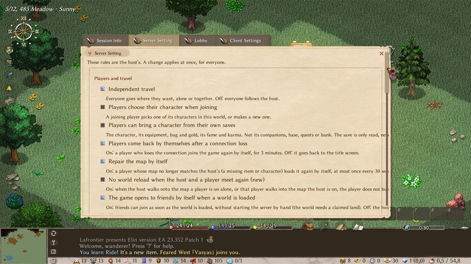
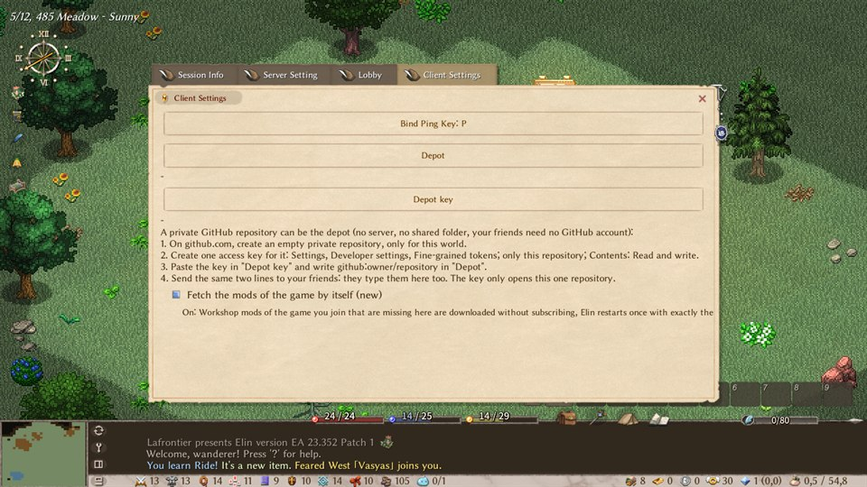
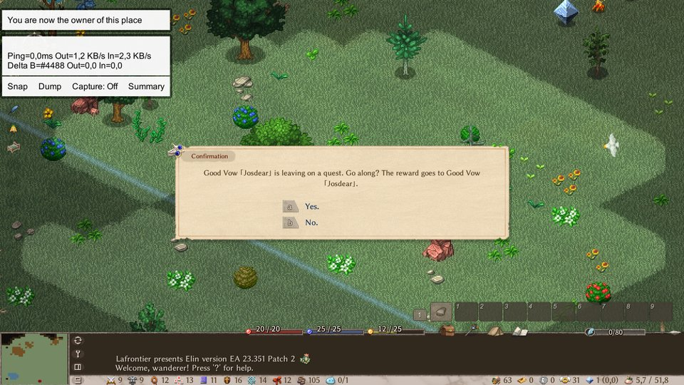
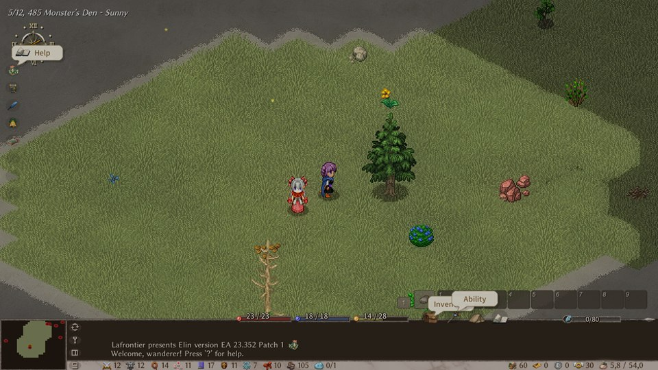
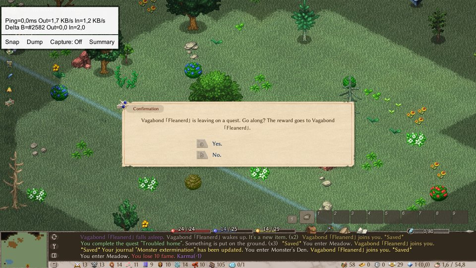
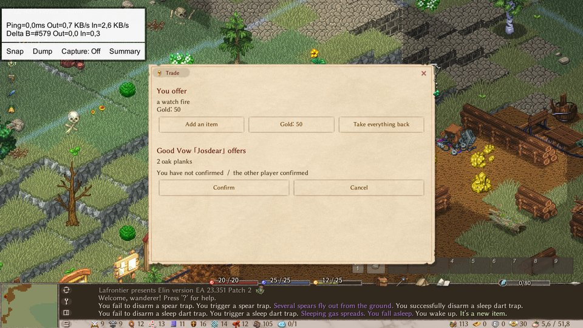
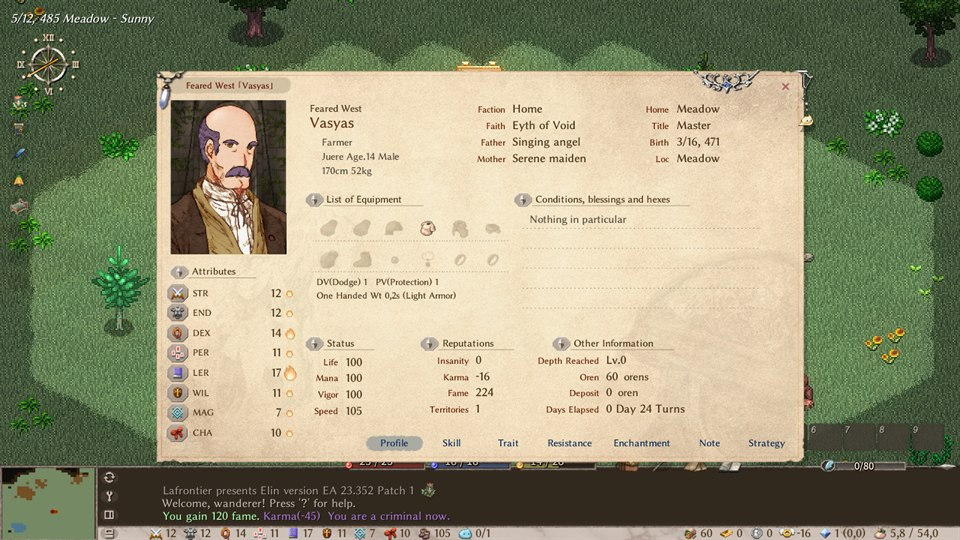
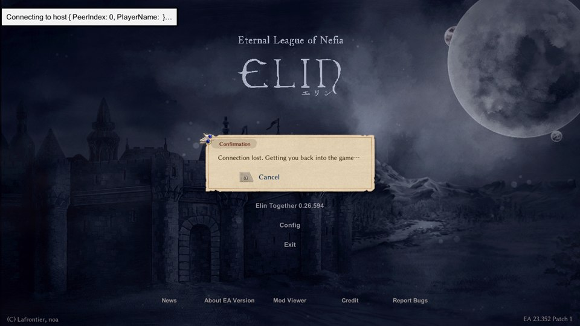

# Elin Together — version « indépendance »

[English](README.md) | Français | [中文](README_zh.md) | [日本語](README_ja.md)

[](https://github.com/devmarcpro/elin-together/releases)

Une version modifiée d'[Elin Together](https://github.com/ElinTogether/ElinTogether), le mod multijoueur
d'[Elin](https://store.steampowered.com/app/2135150/Elin/), avec un seul but : **en jeu, aucune différence entre
l'host et les autres joueurs**. Chacun va où il veut, avec ses compagnons, ses quêtes, sa renommée et son argent ;
le monde (histoire, base, guildes) reste commun. Et le monde lui-même n'a plus besoin de vivre sur le PC d'un seul
joueur.

Le mod d'origine garde tout le groupe sur la carte de l'host et traite les autres joueurs comme ses coéquipiers.
Ses auteurs ne prévoient pas les cartes séparées ; cette version est l'endroit où on l'essaie. Tout le mérite du
mod lui-même leur revient (voir [Crédits](#crédits)).

> **État : expérimental.** Chaque version est une préversion, compilée pour le canal Nightly d'Elin. L'essentiel
> est vérifié par des tests automatiques en jeu, sur un seul PC (deux à cinq fenêtres du jeu). Un seul petit groupe
> y a joué pour de vrai : deux ou trois joueurs par Steam, quelques soirées, et chacune a trouvé des bugs que les
> tests n'avaient pas vus. Chaque note de version dit ce qui a été joué et ce qui ne l'a pas été. Faites d'abord
> une copie de vos sauvegardes : `%USERPROFILE%\AppData\LocalLow\Lafrontier\Elin`.

[Ce que ça change](#ce-que-ça-change) · [Installer](#installer) · [Jouer](#jouer) ·
[Le dépôt](#garder-le-monde-en-ligne--le-dépôt) · [Mods](#mods) · [Réglages de l'host](#réglages-de-lhost) ·
[Limites connues](#limites-connues) · [Compiler](#compiler)

## Ce que ça change

### Chacun va où il veut

- **Voyage indépendant.** Un joueur part sur une autre carte sans l'host. La carte et ce qu'il y fait sont
  conservés, sa progression est sauvée chaque minute, et le chat marche entre toutes les cartes.
- **Cartes partagées.** Un joueur peut en rejoindre un autre sur sa carte, host ou non. Si celui qui tient la carte
  part, un autre la reprend.
- **Personne n'est traîné.** Quand l'host change de carte, les autres restent où ils sont. Un joueur entre sur une
  carte par son entrée ; personne n'est téléporté sur l'host.
- **Chacun à son rythme.** Un monstre agit quand le joueur qu'il combat agit, pas au rythme de l'host, et un invité
  marche aussi régulièrement que l'host.
- **Votre temps est à vous.** Celui qui se couche dort tout de suite ; la nuit ne passe pour le monde que si tous
  dorment en même temps. Quand un autre joueur voyage ou dort, la date avance, mais vous n'avez pas plus faim,
  votre nourriture ne pourrit pas et vos délais de quête ne bougent pas.

### À chaque joueur le sien

- **Les compagnons** suivent le joueur qui les a recrutés, de quelque façon que ce soit (dialogue, boule à monstre,
  monture, animal acheté), voyagent avec lui, comptent dans sa limite d'alliés et obéissent à ses consignes.
- **Quêtes aléatoires, renommée et karma.** Cinq quêtes chacun, avec leur récompense. Le crime aussi : c'est le
  joueur fautif qui perd du karma, et les gardes ne poursuivent que lui.
- **L'argent.** L'argent d'une vente par la caisse d'expédition va à celui qui y a mis l'objet ; un invité paie
  une facture avec son propre or.
- **Votre personnage.** En rejoignant, vous retrouvez le personnage que vous jouiez, sans aucune question ; un
  nouveau joueur crée le sien sur l'écran de création du jeu. L'host peut aussi permettre d'amener un personnage
  d'une sauvegarde solo.
- **Vos réglages.** Fenêtres, combat automatique, tri du sac et consignes des compagnons restent les vôtres à
  chaque changement de carte et à chaque reconnexion.

### Un seul monde pour tous

- **L'histoire.** Les quêtes d'histoire sont dans un seul journal : n'importe qui les lance, les avance, les
  termine. Dialogues déjà vus, objets clés et dette sont communs.
- **La base.** Un invité construit comme l'host (sols, murs, meubles, miner, creuser, couper, zones, outil de
  terrain) et ce que l'un construit se voit chez l'autre tout de suite. Recherche, compétences du foyer,
  politiques, résidents et réglages de coffre peuvent être gérés par n'importe quel joueur. L'host peut garder la
  base pour lui avec une case.
- **Guildes, affinité, codex, banque.** Rejoindre une guilde vaut pour le groupe, l'affinité d'un habitant est la
  même pour tous, les cartes qu'un joueur collecte arrivent dans le codex de tous, et la banque montre le même
  contenu partout.
- **Quêtes à donjon.** N'importe quel joueur peut prendre une quête qui a sa propre zone. Quand il part, l'autre
  voit une boîte Oui/Non pour l'accompagner : la zone est commune et la récompense va à celui qui a pris la quête.
- **Entre joueurs.** Une fenêtre d'échange (chacun met des objets et de l'or, les deux confirment), des duels où
  personne ne meurt et où rien n'est perdu, et pas de meurtre hors duel.

### Un invité joue comme un joueur solo

Des dizaines de corrections pour que ce qui marche pour l'host marche pour un invité : mort et testament, cadeaux
du dieu, autels, pièges, grimoires, guérisseur, bénédictions, investir, runes, rangement automatique, outils tenus
en main, copie chez Kettle, résurrection d'un compagnon chez le barman, fenêtres qui s'ouvraient chez l'host… La
liste est dans [`dev/DOCUMENTATION.md`](dev/DOCUMENTATION.md).

### Le monde ne dépend plus du PC de l'host

- **Un dépôt garde le monde** : un dépôt GitHub privé, un dossier partagé, ou un petit logiciel serveur. Le
  premier arrivé prend le monde et l'héberge, chaque sauvegarde y retourne, et quand il part le suivant prend la
  suite. Voir [le dépôt](#garder-le-monde-en-ligne--le-dépôt).
- **Un monde qui change de main.** Celui qui reprend le monde joue son propre personnage ; l'ancien host retrouve
  le sien quand il rejoint. Si quelqu'un héberge déjà, vous êtes envoyé dans sa partie au lieu d'en ouvrir une
  copie.
- **L'host n'a plus rien à faire.** Le monde se sauvegarde tout seul toutes les 2 minutes quand d'autres jouent, et
  un monde déjà partagé s'ouvre aux amis Steam dès qu'il est chargé.
- **Une coupure est sans conséquence.** Un invité qui perd la connexion revient tout seul dans la partie (il
  essaie pendant 3 minutes).
- **Les jeux restent d'accord.** Aucun message n'est jeté quand la liaison est saturée. Toutes les 2 secondes les
  jeux comparent quelques nombres par carte, et une carte dont l'écart dure est rechargée sur place.
- **Un serveur dédié**, comme un serveur Minecraft : un Elin que personne ne joue fait tourner le monde.

### Les mêmes mods pour tous, sans s'abonner

- **Les mods de la partie arrivent tout seuls.** S'il vous manque des mods du Workshop en rejoignant, ils sont
  téléchargés sans abonnement, Elin se relance une fois avec exactement les mods de la partie et vous y ramène.
  Votre propre liste de mods revient au lancement suivant. Voir [Mods](#mods).
- **Des versions d'Elin différentes peuvent jouer ensemble.** Seule la version du mod doit être la même pour
  tous ; un joueur sur une autre version d'Elin entre avec un avertissement.

Presque tout cela est une **case à cocher côté host** : décochée, le mod se comporte comme l'original. Voir
[Réglages de l'host](#réglages-de-lhost).

## En images

| | |
|---|---|
|  |  |
| Règles de l'host : chaque fonction est une case à cocher | Réglages du joueur : le dépôt, sa clé, et les mods récupérés tout seuls |
|  |  |
| L'host part en quête : l'invité choisit de l'accompagner | Les deux joueurs dans la même zone de quête |
|  |  |
| L'invité part en quête : la même question pour l'host | Échange entre joueurs |
|  |  |
| Chaque joueur a sa renommée et son karma | Une coupure : l'invité est ramené tout seul dans la partie |

## Installer

Il faut Elin sur Steam, sur le canal **Nightly** (Steam → clic droit sur Elin → Propriétés → Bêtas), et le mod
[YK Framework](https://steamcommunity.com/sharedfiles/filedetails/?id=3400020753). S'abonner à
[Elin Together](https://steamcommunity.com/sharedfiles/filedetails/?id=3773298709) sur le Workshop l'amène avec
lui. Lancez Elin une fois après l'abonnement, puis fermez-le.

1. Téléchargez `ElinTogether-independance.zip` sur la
   [page des versions](https://github.com/devmarcpro/elin-together/releases).
2. Décompressez tout le dossier et lancez `Installer.bat`. Il trouve Elin, copie le mod et remplace la version
   Workshop par celle-ci.
3. Lancez Elin par Steam.

`Desinstaller.bat` remet la version Workshop ; rien n'est supprimé. La notice `LISEZMOI.txt` du zip explique tout.

**Sur Mac** (Elin dans CrossOver, Whisky ou Wine) : téléchargez `ElinTogether-independance-mac.zip`,
décompressez-le, ouvrez le Terminal, tapez `bash` puis un espace, faites glisser `Installer-Mac.command` dans la
fenêtre et appuyez sur Entrée. C'est le même mod. Pas encore essayé sur un vrai Mac.

**Tous les joueurs doivent installer la même version.** Ce fork ne se connecte pas à la version du Workshop, ni à
une autre version de lui-même. Chaque version est compilée pour une version d'Elin, écrite dans son titre.

## Jouer

Le panneau du mod s'ouvre par le bouton *Elin Together* de l'écran titre, ou par Échap → Mods → Elin Together en
jeu. Ses onglets : *Lobby*, *Server Setting* (les règles de l'host) et *Client Settings*, plus *Session Info* une
fois la partie ouverte.

- **Héberger.** Chargez une partie qui a un terrain revendiqué, puis *Start Server* dans l'onglet Lobby. Un monde
  déjà partagé s'ouvre tout seul à vos amis Steam.
- **Rejoindre.** Acceptez une invitation Steam, utilisez *Rejoindre la partie* sur le nom de votre ami dans la
  liste d'amis Steam, ou choisissez la partie dans l'onglet Lobby. *Join by address* sert pour un serveur.
- **Les règles.** L'host les règle dans *Server Setting* ; un changement s'applique tout de suite, pour tous.

## Garder le monde en ligne : le dépôt

Un dépôt garde le monde commun en dehors des sauvegardes d'un joueur : le groupe ne dépend plus de la présence
d'une seule personne. Chaque joueur qui peut héberger le règle une fois, dans *Client Settings* : **Depot**, et
**Depot key** quand il y a un mot de passe ou une clé. Un ami qui ne fait que rejoindre n'a besoin ni de l'un ni
de l'autre.

| Dépôt | Ce qu'il faut | Réglage « Depot » |
|---|---|---|
| Dépôt GitHub privé | Un compte GitHub pour un joueur du groupe. Aucun PC à laisser allumé, aucun port à ouvrir. | `github:proprietaire/depot` |
| Elin Together Server (`ElinTogetherServer.exe`, dans le zip) | Un PC qui reste allumé. Elin n'a pas besoin d'y être installé. Port TCP 55557. | `adresse:55557`, ou simplement *Join by address* |
| Dossier partagé | Un dossier que tous les joueurs peuvent atteindre, partagé ou synchronisé. | Le chemin du dossier |

Ensuite, dans l'onglet Lobby :

- **Put this save on the server**, une partie chargée et pas encore ouverte aux autres : cette partie devient le
  monde du dépôt.
- **Take the world from the server and host it**, depuis l'écran titre : vous prenez le dernier monde et vous
  l'hébergez ; les autres vous rejoignent par Steam. Si quelqu'un héberge déjà, le bouton donne son nom et vous
  fait entrer dans sa partie.
- Chaque sauvegarde retourne au dépôt, au plus toutes les 5 minutes et une dernière fois en quittant. Quand l'host
  part, n'importe qui peut prendre le monde. Si l'host plante, le monde se libère tout seul au bout de 3 minutes.

**Avec GitHub**, le joueur qui possède le dépôt :

1. crée sur github.com un dépôt vide et **privé**, uniquement pour ce monde (le mod refuse un dépôt public) ;
2. crée une clé d'accès (« fine-grained token ») limitée à ce dépôt, avec *Contents : Read and write* ;
3. écrit `github:proprietaire/depot` dans **Depot** et colle la clé dans **Depot key** ;
4. donne les deux aux amis qui peuvent héberger. Ils n'ont pas besoin de compte GitHub.

La clé reste en clair dans le fichier de réglages du mod sur chaque PC ; elle n'ouvre que ce dépôt et se révoque
d'un clic. Un monde de plus de 20 Mo en zip est refusé. GitHub garde chaque version du monde : c'est une
sauvegarde de secours gratuite, et cela veut aussi dire que le dépôt grossit à chaque envoi. Quand il devient
gros, supprimez-le et créez-en un nouveau. Le dépôt garde aussi `modlist.txt`, les mods du monde.

**Serveur dédié.** `ElinTogetherServer.exe` a un second mode, « With Elin on this PC: the world runs all the
time » : Elin tourne derrière, sans fenêtre, et les joueurs utilisent *Join by address* (`adresse:55556`, UDP).
`Serveur.bat` fait la même chose avec une fenêtre de jeu. Windows seulement.

## Mods

Quand vous rejoignez une partie, ou prenez un monde dans un dépôt, et qu'il vous manque des mods du Workshop : ils
sont téléchargés sans que votre compte Steam s'abonne à quoi que ce soit, Elin se ferme et se relance **une fois**
avec exactement les mods de la partie, puis vous y ramène. Si des mods à vous bloquent l'entrée, Elin se relance
une fois sans eux. Au lancement suivant d'Elin, vous retrouvez votre propre liste de mods, intacte. Rien n'est
jamais supprimé ni désabonné.

- La liste de référence est le `modlist.txt` du dépôt quand le monde en vient, sinon les mods de l'host.
- Si Elin ne se relance pas tout seul, relancez-le à la main dans la demi-heure : il vous ramène dans la partie.
- Un mod installé à la main, hors Workshop, ne peut pas être téléchargé : son nom est affiché.
- Votre propre liste revient à chaque lancement d'Elin, donc Elin se relance à la première connexion de chaque
  lancement. Pour l'éviter, cochez « Keep the mods of the game (subscribe on the Workshop) » dans *Client Settings* :
  votre compte Steam s'y abonne, Elin se relance encore une fois, puis plus jamais pour cette partie. Pour revenir en
  arrière, désabonnez-vous sur le Workshop.
- Pour garder vos mods et seulement être prévenu des différences, décochez « Fetch the mods of the game by
  itself » dans *Client Settings*.

**Ces mods sont choisis par l'host et leur code tourne sur votre PC : à utiliser avec des gens de confiance.**

AutoAct et Dynamic Riding sont pris en charge. Pour les autres mods, la compatibilité est celle de l'original.

## Réglages de l'host

Échap → Mods → Elin Together → *Server Setting*. Chaque nouveau comportement a sa case, avec une ligne
d'explication en jeu. Les règles sont celles de l'host et s'appliquent à tous dès qu'elles changent. Les noms des
cases sont en anglais dans le jeu.

<details>
<summary>Toutes les cases et leur réglage de départ</summary>

| Case | Au départ | Cochée |
|---|---|---|
| Independent travel | cochée | Chacun va où il veut, seul ou ensemble. Décochée : tout le monde suit l'host. |
| Players choose their character when joining | décochée | En rejoignant, le joueur choisit un de ses personnages de ce monde, ou en crée un. Décochée : le dernier joué. |
| Players can bring a character from their own saves | décochée | Le personnage, son équipement, son sac, son or, sa renommée et son karma. Pas ses compagnons, sa base, ses quêtes ni sa banque. La sauvegarde est seulement lue. |
| Random quests, fame and karma per player | cochée | 5 quêtes aléatoires chacun, avec récompense, renommée et karma. Les quêtes d'histoire restent communes. |
| Shipping per player | cochée | L'argent de l'expédition va à celui qui a déposé l'objet. Décochée : tout va à l'host. |
| Trade window between players | cochée | Clic sur un autre joueur pour échanger objets et or. Les deux confirment. |
| Other players can use build mode | cochée | Les autres joueurs construisent dans la base ; ils paient l'or et les matériaux. Décochée : seul l'host construit. |
| Only the host manages the base | décochée | Ce que les autres demandent à la base (recherche, politiques, résidents, mode construction…) est refusé. |
| Duels between players | cochée | « Challenge to a duel » sur le personnage d'un autre joueur. Personne ne meurt, les deux sont soignés, rien n'est perdu. |
| Players can kill each other | décochée | Décochée : un coup qui tuerait le personnage d'un autre joueur le laisse à 0 point de vie. |
| Combat on each player's time | cochée | Un monstre agit quand le joueur qu'il combat agit : personne n'attend. Passe avant le combat au tour par tour. |
| Each player on its own clock | cochée | Un invité marche et agit aussi régulièrement que l'host, pas au rythme du réseau. |
| Every player walks at the pace of a solo game | cochée | La durée d'un pas ne dépend plus de la vitesse des autres joueurs. |
| One date for the whole world | cochée | Le temps passé par un joueur seul sur une autre carte compte pour tous. Décochée : seule la date de l'host compte. |
| What time does to the world happens once | cochée | Météo, quêtes expirées, impôts, salaires et lettres sont faits par un seul jeu. |
| Everyone sleeps for themselves | cochée | Celui qui se couche dort tout de suite. La nuit passe pour le monde quand tous dorment en même temps. |
| Time only jumps when everyone jumps | cochée | Un pas sur la carte du monde ne fait avancer la date que si tous les joueurs voyagent ensemble. |
| Tax on the most famous player | cochée | L'impôt du mois est calculé sur la plus haute renommée des joueurs connectés. Décochée : sur celle de l'host. |
| Auto-dump spares hand and tool belt | cochée | Le rangement automatique laisse ce que vous tenez et votre ceinture à outils. Décochée : comme le jeu. |
| Players come back by themselves after a connection loss | cochée | Un joueur qui perd la connexion revient tout seul dans la partie, pendant 3 minutes. |
| Repair the map by itself | cochée | Un joueur dont la carte ne correspond plus à celle de l'host la recharge, au plus une fois toutes les 30 secondes. |
| The world is saved by itself while others play | cochée | Toutes les 2 minutes tant qu'un autre joueur est dans la partie, et quand le dernier part. |
| The game opens to friends by itself when a world is loaded | cochée | Les amis peuvent rejoindre sans que l'host lance le serveur à la main. |
| The other players keep a copy of the world | décochée | Après chaque sauvegarde automatique, le PC de chaque joueur garde une copie du monde, hors de ses sauvegardes. |
| No world reload when the host and a player meet again (new) | décochée | Le joueur reste sur sa carte, ou ne charge que cette carte, au lieu du monde entier. |
| Show the mods of the game to the players | cochée | La liste des mods est connue avant de rejoindre, et un joueur refusé apprend quels mods diffèrent. |
| Require the same Elin version | décochée | Un joueur sur une autre version d'Elin est refusé. Décochée : il entre avec un avertissement. |
| Turn-Based Combat | cochée | Règle du mod d'origine. Sans effet tant que « Combat on each player's time » est cochée. |
| Shared Average Speed | décochée | Règle du mod d'origine : une seule vitesse pour tous les joueurs, la moyenne. |

</details>

## Limites connues

- **Un seul petit groupe y a joué pour de vrai.** Une bonne part du travail récent n'a tourné qu'au banc de test.
  « Pas joué » dans une note de version ou un message de commit veut dire exactement cela.
- **Quand l'host part ou plante, aucun invité ne reprend le monde tout seul.** Quelqu'un le prend dans le dépôt, à
  la main.
- **Une seule date pour le monde**, celle du joueur le plus avancé ; seuls ses effets (faim, pourriture, délais)
  sont propres à chacun. Quand l'host dort seul, la date avance quand même d'environ 40 minutes. Sur la carte du
  monde, quand tous voyagent ensemble, seuls les pas de l'host la font avancer.
- Pendant les quelques secondes de sa nuit à soi, un joueur peut être attaqué : le monde continue pour les autres.
- Quand l'host et un invité se retrouvent sur une carte, l'écran de l'invité recharge. La case « No world reload
  when the host and a player meet again » l'évite ; elle est nouvelle et décochée au départ.
- Sur l'écran de l'host, les invités qui marchent peuvent avancer par à-coups de trois cases.
- Un joueur refusé par celui qui tient une carte reçoit encore le monde entier.
- **Plus de trois joueurs** : cinq fenêtres du jeu ont été testées sur un seul PC, jamais cinq vrais PC. Attendez-vous
  à ce que le jeu ralentisse quand le nombre de joueurs augmente.
- Quêtes à donjon à deux, quand c'est l'invité qui a la quête : « subjuguer », récolte et musique. La défense se
  fait seul.
- Les duels n'ont ni arène, ni pari, ni bouton pour abandonner. Un objet équipé ne peut pas être échangé.
- Mods récupérés tout seuls : ceux du Workshop seulement. Pas essayé avec Elin relancé par Steam, par un salon
  Steam, sur Steam Deck ou Linux, ni sur Mac.
- Quelques conflits rares sont connus et pas corrigés : deux joueurs qui construisent sur la même case, une
  monture qui existe en double après un voyage.

La liste complète, et ce qui est prévu : [`dev/DOCUMENTATION.md`](dev/DOCUMENTATION.md).

## En cas de problème

- L'host décoche la case en cause : sur ce point, le mod se comporte de nouveau comme l'original.
- Un joueur dont le jeu ne correspond plus à celui des autres tape `emp.reconnect_self` dans la console.
- Signalez-le dans [les tickets de ce dépôt](https://github.com/devmarcpro/elin-together/issues), avec les
  fichiers `Player.log` et `ElinMP/Logs/Session_<date>.log` de chaque joueur
  (`%USERPROFILE%\AppData\LocalLow\Lafrontier\Elin`). Merci de ne pas signaler au projet d'origine les problèmes
  de ce fork.

## Compiler

Variables d'environnement : `ElinGamePath` (dossier du jeu) et `SteamContentPath` (`steamapps/workshop/content`,
pour `YKFramework.dll`). SDK .NET 11.0 preview, voir `global.json`.

```ps
git clone https://github.com/devmarcpro/elin-together
cd elin-together
dotnet restore ./ElinTogether --locked-mode
dotnet build ./ElinTogether -c ReleaseNightly
```

`dev/make_release.ps1` fabrique les deux zips d'une version, Windows et Mac. Le poste de développement (plusieurs
fenêtres du jeu sur un PC, suites de tests en jeu, pont de test) est décrit dans [`dev/SETUP.md`](dev/SETUP.md).

## Comment ça marche, en bref

Le principe d'origine : l'host simule le monde, chaque changement part vers les clients, les clients envoient
leurs actions à l'host. Cette version ajoute des **baux de zone** : un joueur qui quitte la carte de l'host lui
demande un bail sur la carte où il va, charge sa propre copie du monde et simule cette carte lui-même. Il la
renvoie à son retour et à chaque point de sauvegarde ; l'host reste la référence. Celui qui tient un bail peut
accueillir d'autres joueurs sur cette carte, et le passe à l'un d'eux quand il part.

Un dépôt, c'est le monde en une seule archive, plus un verrou qui dit qui héberge. L'host renouvelle le verrou
chaque minute ; un verrou qui n'a pas été renouvelé depuis 3 minutes est libre.

## Crédits

Le mod est l'œuvre de l'équipe Elin Together : [DK](https://github.com/gottyduke) et
[Redgeioz](https://github.com/Redgeioz) (code, architecture), [105gun](https://github.com/105gun) (code),
[Han](https://github.com/chuahan), Omega, [InuiDame](https://github.com/InuiDame),
[Drakeny](https://github.com/Drakeny) (tests), noa (Elin). Licence MIT, voir [LICENSE](LICENSE).

Les changements de ce fork ont été écrits avec un assistant de programmation (Claude Code), dirigé par le
propriétaire du fork ; chaque changement a son test en jeu, cité dans le message du commit. Aucun fichier du jeu
ni code décompilé du jeu n'est dans ce dépôt.
